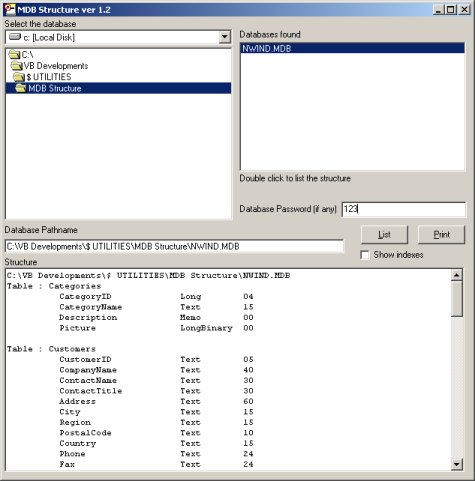



## MDB Structure\.zip

### Description

Document your Access database structures with ease.
 
### More Info
 
Locate the MDB you want to analyse

View and, optionally, print the database tables and fields.

             |
---                |---
**Submitted On**   |2003-05-14 11:52:50
**By**             |[Mike Yates](https://github.com/Planet-Source-Code/PSCIndex/blob/master/ByAuthor/mike-yates.md)
**Level**          |Advanced
**User Rating**    |4.7 (42 globes from 9 users)
**Compatibility**  |VB 6\.0
**Category**       |[Databases/ Data Access/ DAO/ ADO](https://github.com/Planet-Source-Code/PSCIndex/blob/master/ByCategory/databases-data-access-dao-ado__1-6.md)
**World**          |[Visual Basic](https://github.com/Planet-Source-Code/PSCIndex/blob/master/ByWorld/visual-basic.md)
**Archive File**   |[MDB\_Struct159887692003\.zip](https://github.com/Planet-Source-Code/mike-yates-mdb-structure-zip__1-46074/archive/master.zip)

